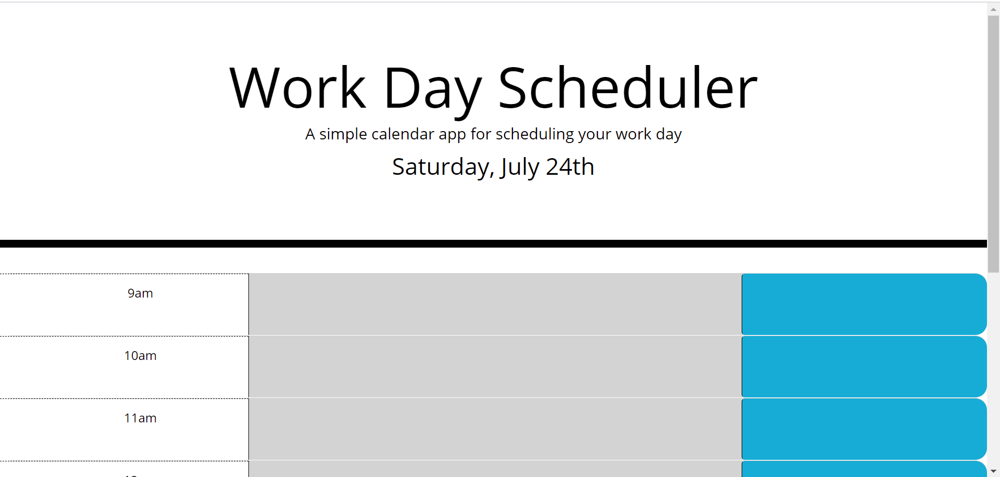

# day-calender
## Description

The task was to create a calendar that would upload the users task in time slot and save into a local storage. The time slot would also change colors to indicate with the task was in the past(gray), present(red), and future(green). This project involved the use of third-party APIs. 

## Screenshot

## built With
*html
*CSS
*jQuery
*BootStrap
*Moment.js

## website
http://aclarke0307.github.io/day-calender/

## Contributing
aclarke0307
